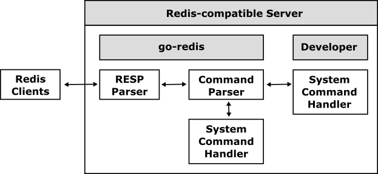

# go-redis

The go-redis is a database framework for implementing a Redis compatible database server using Go easily.

## What is the go-redis?

The go-redis handles RESP (REdis Serialization Protocol) and interprets any commands based on the RESP so that all developers can develop Redis compatible servers easily. Because the go-redis is a compatible framework based on RESP and Redis command specifications, all developers can connect to a compatible server based on the go-redis using general client drivers for Redis as the following.

The go-redis handles all system commands such as PING and SELECT automatically, and so the developers can easily implement their Redis compatible server only by simply handling user commands such as SET and GET.

## Table of Contents

- [How to implement a Redis compatible server?](doc/server_impl.md)
- [Inside of go-redis](doc/server_inside.md)

## Examples

- [go-redis-server](examples/go-redis-server)

## References

- [Redis](https://redis.io)
- [RESP (REdis Serialization Protocol)](https://github.com/cybergarage/go-redis.git)
