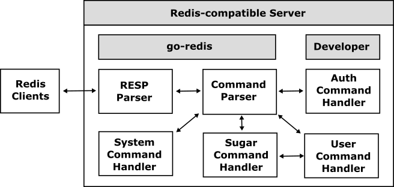

# Inside of go-redis

The go-redis handles RESP (REdis Serialization Protocol) and interprets any commands based on the RESP so that all developers can develop Redis-compatible servers easily. Because the go-redis is a compatible framework based on RESP and Redis command specifications, all developers can connect to a compatible server based on the go-redis using general client drivers for Redis as the following.

The go-redis handles all system commands such as PING and SELECT automatically, and so the developers can easily implement their Redis-compatible server only by simply handling user commands such as SET and GET.

## Supported commands

The go-redis defines the [CommandHandler](../redis/handler.go) for the following supported Redis commands as the system and user command handler.

### Connection commands

[format="csv", options="header, autowidth"]
|====
include::./cmds/connection.csv[]
|====

### Server management commands

[format="csv", options="header, autowidth"]
|====
include::./cmds/server_management.csv[]
|====

### Generic commands

[format="csv", options="header, autowidth"]
|====
include::./cmds/generic.csv[]
|====

### String commands

[format="csv", options="header, autowidth"]
|====
include::./cmds/string.csv[]
|====

### Hash commands

[format="csv", options="header, autowidth"]
|====
include::./cmds/hash.csv[]
|====

### List commands

[format="csv", options="header, autowidth"]
|====
include::./cmds/list.csv[]
|====

### Set commands

[format="csv", options="header, autowidth"]
|====
include::./cmds/set.csv[]
|====

### Sorted set commands

[format="csv", options="header, autowidth"]
|====
include::./cmds/sset.csv[]
|====

### Bitmap commands

[format="csv", options="header, autowidth"]
|====
include::./cmds/bitmap.csv[]
|====
